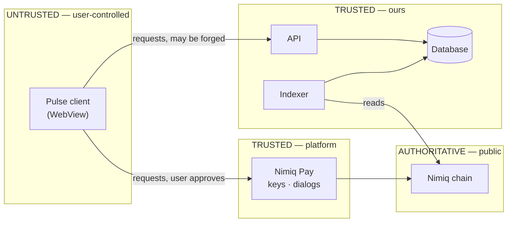

# Nimiq Pulse — Security

| Field | Value |
| --- | --- |
| Version | 1.0 · 31 July 2026 |
| Scope | Mini App client, API, indexer |
| Related | [TDD.md](TDD.md) §10 · [software_architecture.md](software_architecture.md) · [ERROR_HANDLING.md](ERROR_HANDLING.md) |

---

## 1. Security posture in one line

**Pulse never holds funds, never sees a private key, and never trusts its own client.**

Everything below follows from those three. The platform gives us the first two for free; the third is the one we have to engineer.

---

## 2. Trust boundaries



The client can be modified, its traffic replayed, its storage edited. **Everything it sends is a claim, not a fact.** Every claim that matters is re-derived server-side from the chain.

---

## 3. Platform guarantees we rely on

| Guarantee | Source |
| --- | --- |
| Private keys never leave Nimiq Pay | Sandboxed WebView; no key API exists |
| Every sensitive action requires native user approval | Host-mediated, cannot be bypassed |
| Mini Apps cannot suppress or fake the approval dialog | Host-side rendering |
| Device identifier is pseudonymous and origin-scoped | SDK contract |

We do not attempt to work around any of these. Attempting to is an explicit anti-pattern in the platform rules and a pre-ship checklist failure.

---

## 4. Authentication

### 4.1 Design

One approval dialog, and the address is **proven** rather than reported.

1. Client requests a nonce: `POST /auth/challenge`.
2. Server issues a single-use nonce, 5-minute expiry, bound to an exact challenge string.
3. Client calls `sign(message)` — one approval dialog.
4. Client posts `{ nonce, publicKey, signature }`.
5. Server verifies the signature over the exact challenge string, **derives the address from the public key**, burns the nonce, issues a JWT.

```ts
const key = Nimiq.PublicKey.fromHex(publicKey)
const ok = key.verify(Nimiq.Signature.fromHex(signature), new TextEncoder().encode(challenge))
if (!ok) throw new Unauthorized()
const address = key.toAddress().toUserFriendlyAddress()   // never taken from the request
```

**The address is never read from the request body.** If it were, any client could claim any wallet. Deriving it from the verified public key is what makes the whole identity model sound.

### 4.2 Threats addressed

| Threat | Mitigation |
| --- | --- |
| Impersonating another wallet | Address derived from the signature, not supplied |
| Replaying a captured signature | Single-use nonce, 5-min expiry, burned on use |
| Cross-origin signature reuse | Challenge string includes the app name and nonce |
| Token theft from `localStorage` | Short-lived JWT (7 d), no refresh token stored, re-login costs one dialog |
| Token forgery | HS256 with a server-only secret; `JWT_SECRET` never reaches the client |

Storing the token in `localStorage` is a conscious trade: the WebView has no reliable shared cookie context, and the blast radius of theft is *someone else's XP*, not their money. Pulse cannot move funds under any circumstances.

---

## 5. Authorisation

Every write re-checks eligibility server-side at the moment of the write. The client's view of what it may do is a **hint for rendering**, never a permission.

| Action | Server check |
| --- | --- |
| Publish a review | Indexed interaction from this wallet to this app, ≥ `MIN_REVIEW_LUNA`, ≥120 confirmations |
| Claim a quest | Indexed on-chain evidence matching the quest type; never the client's assertion |
| Submit an app | Valid session; address format valid; address not already registered |
| Read a profile | Session address only — no reading another wallet's profile |

---

## 6. The client is untrusted — worked examples

| Client claims | Server does |
| --- | --- |
| "I completed the tip quest, hash 0xabc" | Looks the hash up in indexed data; verifies sender, recipient, and amount. The indexer would have found it anyway — the hash only speeds lookup |
| "I paid this app, let me review" | Ignores the claim; queries `interactions` |
| "My XP is 5000" | Never accepted. XP is only ever computed from persisted rows |
| "I am NQ16 085S…" | Never accepted. Address comes from the verified signature |

---

## 7. Abuse resistance

XP is derived from payments the user initiates, so farming incentive is structural. See [PRD.md](PRD.md) §11.

| Vector | Control |
| --- | --- |
| Self-dealing (register own address, pay it repeatedly) | First-interaction XP once per `(wallet, app)`; repeat capped at 15 XP/app/UTC day; **registry owner earns no XP from payments to their own app** |
| Sybil wallets | `requestDeviceIdentifier()` caps limited rewards per device; stored hashed, used only for rate limits |
| Dust spam to inflate rankings | Trending counts **distinct wallets**, not transactions, with a minimum amount |
| Review farming | One review per wallet per app; minimum payment; rating hidden below 3 reviews |
| Malicious registry entry | Moderation before feed visibility; unique-address constraint |
| API flooding | Rate limits: 10/min unauthenticated, 60/min authenticated, 5/min on writes |

The device identifier is used **only** for abuse limits, stored as a hash, never joined to behavioural data, and never used for tracking or analytics.

---

## 8. Input handling

| Input | Control |
| --- | --- |
| Review text | ≤280 chars, server-sanitised, rendered via Vue text interpolation |
| App name, description | ≤100 chars, sanitised, plain text only |
| App URL | Scheme allowlist (`https:` only), no `javascript:`, no `data:` |
| Nimiq address | Format-validated client-side, re-validated server-side |
| Amounts | Integer Luna, positive, bounded; never floats |

**`v-html` appears nowhere in the codebase.** This is a lint rule, not a convention. Every user-supplied string renders through interpolation.

Registry URLs are attacker-influenced and become `nimiqpay://miniapp?url=…` deeplinks, so they are validated on write and on read.

---

## 9. Transport and origin

| Control | Value |
| --- | --- |
| Production transport | HTTPS only, HSTS |
| CORS | Explicit allowlist of the Mini App origin. **Never `*`** in production |
| Dev CORS | LAN origin (`http://192.168.x.x:5173`) allowlisted only in the dev config |
| Secrets in client | Zero. RPC URL and credentials are backend-only |
| Node exposure | Private network; never reachable from the client |

**The production origin must be fixed before launch.** The device identifier is origin-scoped, so changing the domain silently resets every device-based abuse limit. This makes the origin part of the security model, not just deployment config.

---

## 10. Privacy

Pulse reads public chain data. That does not make storing all of it acceptable.

- **Stored:** only interactions matching a registry address.
- **Not stored:** a wallet's unrelated transaction history. It is read transiently during backfill and discarded.
- **Not collected:** email, name, IP-derived location, device fingerprint beyond the platform's own pseudonymous identifier.
- **Disclosed before the first approval**, on the Connect screen: *"Pulse reads your public payment history to find Mini Apps you'll like. It only stores payments to listed apps."*

Disclosure sits above the Connect button, not in a footer or a linked policy. A user should know what they are agreeing to before the dialog appears, not after.

---

## 11. Secrets

| Secret | Where |
| --- | --- |
| `JWT_SECRET` | Backend env only |
| `NIMIQ_RPC_AUTH` | Backend env only |
| `DATABASE_URL` | Backend env only |

No secret is ever placed in a `VITE_`-prefixed variable — Vite inlines those into the client bundle. Client config is limited to the API base URL and the tip-jar address, both of which are public by nature.

---

## 12. Pre-ship checklist mapping

Checklist section 3 (Security) and 4 (Error handling):

- [x] No attempt to access private keys — no such API is called
- [x] No attempt to bypass or suppress the approval dialog — all calls go through the host
- [x] No hardcoded keys, seeds, or credentials — verified by secret scan in CI
- [x] All sensitive actions go through the provider
- [x] User rejection handled gracefully — [ERROR_HANDLING.md](ERROR_HANDLING.md) rows 3–4
- [ ] `eth_signTypedData_v4` — **not applicable**, no EVM provider in v1

---

## 13. Threats accepted

Stated plainly rather than hidden:

| Accepted | Why | Bound |
| --- | --- | --- |
| Session token theft via device compromise | Cannot defend a compromised device from the app layer | Attacker gains someone's XP; cannot move funds |
| A determined farmer with many real wallets and devices | Full Sybil resistance would need identity verification, which contradicts the product | Caps and moderation raise cost above the reward |
| Moderator error approving a bad app | Human process | Reviews and removal; existing reviews retained on delisting |
| Indexer lag misrepresenting recent activity | Chain finality takes time | 120-confirmation depth; "catching up" banner |
