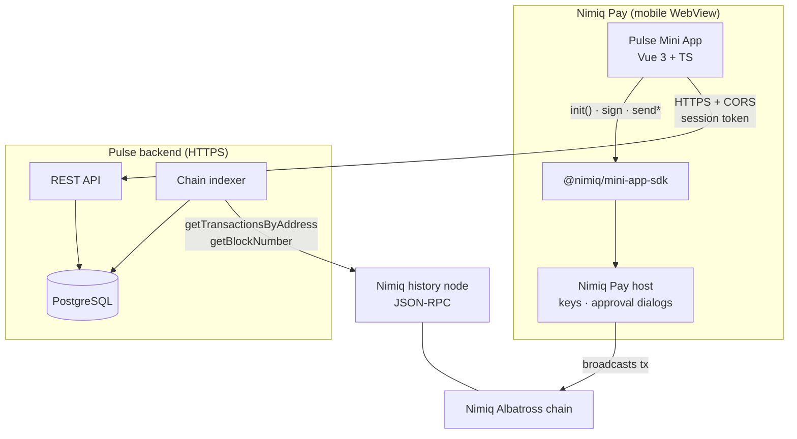
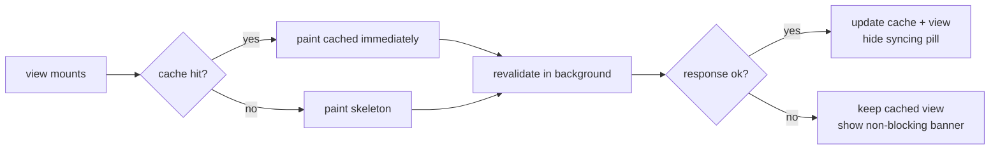
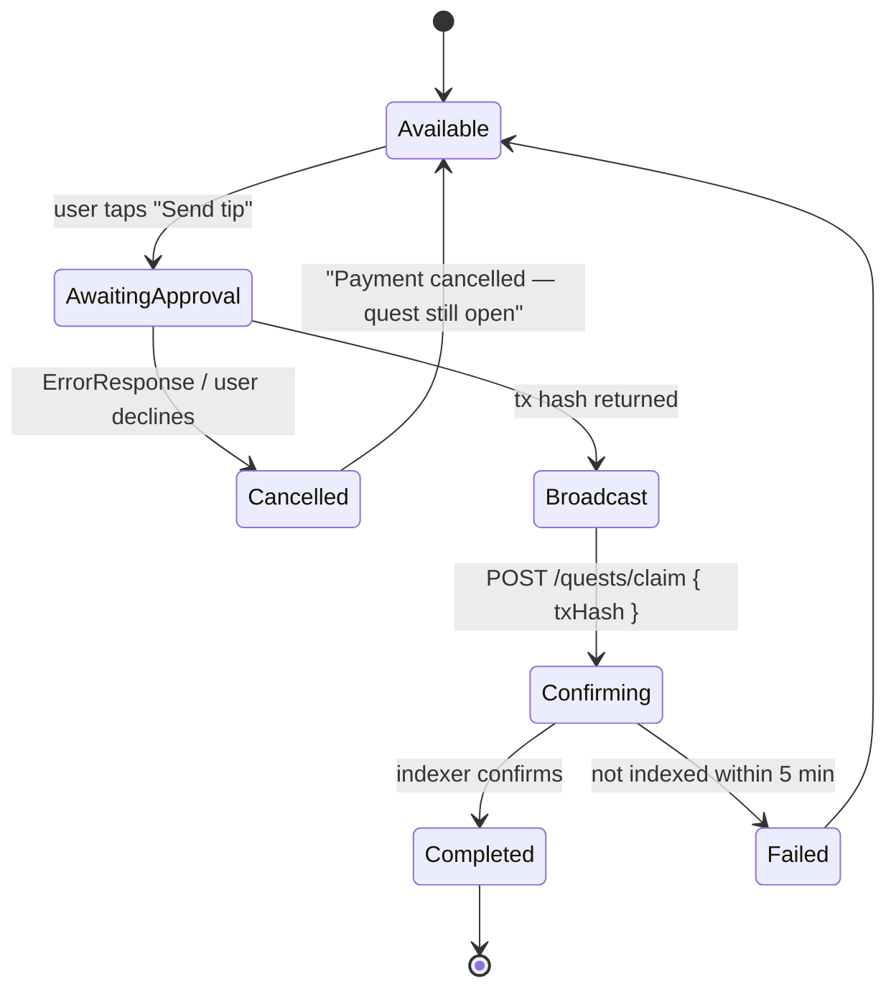
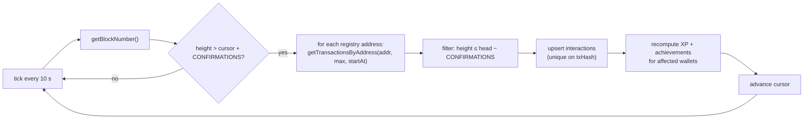
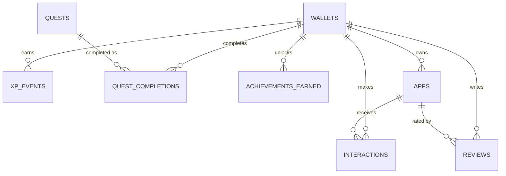

# Nimiq Pulse — Technical Design Document

| Field | Value |
| --- | --- |
| Product | Nimiq Pulse |
| Version | 1.0 |
| Date | 31 July 2026 |
| Status | Draft for build |
| Audience | Engineers implementing Pulse |
| Related | [PRD.md](PRD.md) · [software_architecture.md](software_architecture.md) |

---

## 1. Purpose and scope

This document specifies **how** Pulse is built: platform constraints, component design, data model, API surface, algorithms, error handling, security, and test plan. Product intent lives in the PRD; architectural rationale and decision records live in the architecture document.

---

## 2. Verified platform facts

Everything in this section was verified directly against the installed SDK, the installed `mini-apps` skill, or the live network — not assumed. Anything unverified is marked as such.

### 2.1 Nimiq provider surface (`@nimiq/mini-app-sdk@0.1.0`)

Read from `node_modules/@nimiq/mini-app-sdk/dist/provider.d.ts`.

| Method | Returns | Approval dialog |
| --- | --- | --- |
| `listAccounts()` | `Promise<string[] \| ErrorResponse>` | yes |
| `sign(message)` | `Promise<SignatureResult \| ErrorResponse>` | yes |
| `isConsensusEstablished()` | `Promise<boolean>` | no |
| `getBlockNumber()` | `Promise<number>` | no |
| `sendBasicTransaction({ recipient, value, fee?, validityStartHeight? })` | `Promise<string \| ErrorResponse>` | yes |
| `sendBasicTransactionWithData({ recipient, value, data, fee?, validityStartHeight? })` | `Promise<string \| ErrorResponse>` | yes |
| `sendNewStakerTransaction` / `sendStakeTransaction` / `sendSetActiveStakeTransaction` / `sendUpdateStakerTransaction` / `sendRetireStakeTransaction` / `sendRemoveStakeTransaction` | `Promise<string \| ErrorResponse>` | yes |

`SignatureResult` is `{ publicKey: string, signature: string }`. `ErrorResponse` is `{ error: { type: string, message: string } }`.

Module-level helpers: `init(options?: { timeout?: number })`, `getHostLanguage(): string | undefined`, `requestDeviceIdentifier({ reason }): Promise<string>`.

> **CRITICAL — the SDK resolves with errors, it does not reject.**
> The skill's API reference documents `listAccounts()` as returning `string[]`. The real signature is `Promise<string[] | ErrorResponse>`, and this applies to `sign` and every `send*Transaction` method. When a call fails **or the user declines the approval dialog**, the promise *fulfils* with `{ error: { type, message } }`. A plain `try/catch` therefore reads a user denial as success. Every wallet call MUST pass through the `unwrap()` helper in `src/provider.ts`, which converts an `ErrorResponse` into a thrown error so one `catch` covers both failure modes.

### 2.2 What the provider cannot do

There is **no** method for transaction history, balances, account state, or address-scoped queries. This is the single most consequential constraint in the system: the entire Pulse mechanic depends on reading wallet history against a registry, and the provider cannot supply it. Chain history must come from elsewhere (§5).

### 2.3 Host environment

| Fact | Value | Source |
| --- | --- | --- |
| Runtime | Mobile WebView inside Nimiq Pay | skill |
| Deeplink | `nimiqpay://miniapp?url=your-app.com` | nimiq.dev |
| Unknown URL | Nimiq Pay warns before loading | nimiq.dev |
| Local dev | `npm run dev -- --host`, enter LAN URL in Mini Apps → Custom URL | nimiq.dev |
| Secure context | LAN dev is plain HTTP, so `crypto.randomUUID()` and other secure-context APIs may be unavailable on device | nimiq.dev |
| User language | `window.nimiqPay.language`, ISO 639-1, injected before page scripts, read-only | SDK types |
| Device identity | `requestDeviceIdentifier({ reason })` → 64-char hex SHA-256, per-origin, stable across reinstalls, identifies device not user, prompts on first call | SDK types |
| Testnet | Long-press settings 10 s for the dev menu; testnet affects Nimiq provider operations only | skill |
| Denomination | 1 NIM = 100 000 Luna | skill + provider docs |
| Keys | Never accessible; all signing via approval dialog | skill |

### 2.4 Chain constants (verified live against mainnet)

Measured by running `@nimiq/core@2.7.2` against mainnet on 31 July 2026:

| Constant | Value |
| --- | --- |
| `BLOCKS_PER_BATCH` | 60 |
| `BLOCKS_PER_EPOCH` | 43 200 |
| `SLOTS` | 512 |
| `TOTAL_SUPPLY` | 2 100 000 000 000 000 Luna (21 B NIM) |
| Staking contract | `NQ77 0000 0000 0000 0000 0000 0000 0000 0001` |
| Block time | ~1 s |

Two behaviours observed live that affect indexer design: the head-changed listener **fires twice for every macro block**, and during sync the head **jumps thousands of blocks at once** (observed 57 628 800 → 57 657 900). Both must be handled as deduplication and discontinuity, not as real events.

### 2.5 Data-source investigation (unresolved — see §5)

| Endpoint | Result |
| --- | --- |
| `rpc.nimiq.com` | Does not resolve (NXDOMAIN) |
| `rpc.nimiq-testnet.com` | Resolves to 35.187.19.237; HTTP **405** on POST at `/`, `/rpc`, `/jsonrpc`; TLS verification failed from the test machine |
| `api.nimiq.watch` | HTTP 200, but serves the Nimiq.Watch v2 explorer UI, not a documented JSON API |

`getTransactionsByAddress(address, max, startAt)` is a documented Albatross JSON-RPC method returning transactions in descending order, but **no public endpoint was confirmed reachable**. The design therefore does not depend on one.

---

## 3. System overview



**Trust boundaries.** The client is untrusted: it may lie about anything. All XP, quest completion, review eligibility, and achievements are computed server-side from indexed chain data. The client renders state; it never asserts it.

---

## 4. Client design

### 4.1 Stack

Vue 3 + TypeScript + Vite (already scaffolded). Nimiq provider only — no EVM, so no `viem` and no `window.ethereum`.

### 4.2 Module layout

```
src/
├─ main.ts                 # bootstrap
├─ App.vue                 # shell, tab router, global banners
├─ provider.ts             # unwrap(), isErrorResponse(), message()  [exists]
├─ wallet/
│  ├─ session.ts           # login flow, token storage, refresh
│  └─ useWallet.ts         # reactive wallet/session state
├─ api/
│  ├─ client.ts            # fetch wrapper: auth, retry, timeout, error mapping
│  └─ endpoints.ts         # typed calls, one per API route
├─ cache/
│  └─ store.ts             # stale-while-revalidate over localStorage
├─ features/
│  ├─ profile/             # identity card, XP bar, achievements
│  ├─ discover/            # feed, app detail, submit form
│  ├─ quests/              # quest list, tip-jar flow
│  └─ reviews/             # review list, composer
└─ ui/                     # shared primitives (Card, Button, Banner, XpBar)
```

### 4.3 Authentication — one approval dialog, not two

The naive flow calls `listAccounts()` to learn the address, then `sign()` to prove ownership: **two consecutive approval dialogs on load**, which violates the approval-sequencing rule and doubles onboarding friction.

Instead, exploit the fact that `sign()` returns the public key, and a Nimiq address is derived from its public key:

```mermaid
sequenceDiagram
    participant U as User
    participant C as Pulse client
    participant S as Pulse backend
    participant P as Nimiq Pay

    U->>C: taps "Connect wallet"
    C->>S: POST /auth/challenge
    S-->>C: { nonce, expiresAt }
    C->>P: sign("Nimiq Pulse login\nnonce: <nonce>")
    P->>U: native approval dialog (ONE)
    U-->>P: approve
    P-->>C: { publicKey, signature }
    C->>S: POST /auth/verify { nonce, publicKey, signature }
    S->>S: verify signature; derive address from publicKey; burn nonce
    S-->>C: { sessionToken, profile }
```

Server-side verification uses `@nimiq/core` (Node build):

```ts
import * as Nimiq from '@nimiq/core'

const key = Nimiq.PublicKey.fromHex(publicKey)
const sig = Nimiq.Signature.fromHex(signature)
const ok  = key.verify(sig, new TextEncoder().encode(challengeMessage))
const address = key.toAddress().toUserFriendlyAddress()
```

This yields the authenticated address with **one** dialog. `listAccounts()` is not used in the login path at all.

Nonces are single-use, expire in 5 minutes, and are bound to the exact challenge string to prevent replay. Session tokens are JWTs, 7-day expiry, stored in `localStorage` (WebView has no shared cookie context worth relying on), and sent as `Authorization: Bearer`.

### 4.4 Cached-first data flow



Cache entries carry `{ data, fetchedAt, ttl }`. Feed and profile TTL is 5 minutes; registry TTL is 1 hour. A stale entry still paints — freshness never blocks rendering (PRD AC1.3, AC1.4).

The syncing indicator is a small inline pill, never a blocking spinner or full-screen overlay.

### 4.5 Approval-dialog sequencing

Enforced by a module-level mutex in `provider.ts`:

```ts
let approvalInFlight: Promise<unknown> | null = null

export async function withApproval<T>(fn: () => Promise<T>): Promise<T> {
  if (approvalInFlight) throw new Error('Another confirmation is already open')
  approvalInFlight = (async () => fn())()
  try { return await approvalInFlight as T } finally { approvalInFlight = null }
}
```

Every approval-requiring call is wrapped. Read-only calls (`isConsensusEstablished`, `getBlockNumber`) bypass it and may be batched with `Promise.all`.

### 4.6 Tip-jar quest flow



The client polls `/quests/today` with backoff (2 s → 4 s → 8 s, capped at 30 s) while any quest is `Confirming`. Polling stops when the view unmounts.

### 4.7 Secure-context fallback

LAN dev runs over plain HTTP, so `crypto.randomUUID()` may be unavailable on device. All ID generation goes through:

```ts
export function id(): string {
  if (globalThis.crypto?.randomUUID) return crypto.randomUUID()
  const b = new Uint8Array(16)
  globalThis.crypto.getRandomValues(b)
  b[6] = (b[6] & 0x0f) | 0x40
  b[8] = (b[8] & 0x3f) | 0x80
  return [...b].map((x, i) => (([4, 6, 8, 10].includes(i) ? '-' : '') + x.toString(16).padStart(2, '0'))).join('')
}
```

Client-generated IDs are used only for local idempotency keys, never for anything security-relevant.

---

## 5. Chain data source

> **Superseded 31 July 2026.** This section originally specified a self-hosted Nimiq history node. Measurement showed an **embedded `@nimiq/core` light client inside the backend** does the job: mainnet consensus in ~36–40 s, automatic peering with history nodes, and `getTransactionsByAddress` returning full transaction detail in 11–16 s per address. There is no history node and no external RPC. Implementation: `pulse-api/src/chain.ts`. See [software_architecture.md](software_architecture.md) ADR-2. Everything below about *never querying the chain from the client* still stands.

**Decision: chain access lives only in the backend; the client never queries the chain.**

Rationale:
1. The provider offers no history (§2.2).
2. No public RPC endpoint was confirmed reachable (§2.5), so depending on one is an unacceptable demo-day risk.
3. Registry co-occurrence, XP, quests, and reviews all need persistent shared state that only a server can hold.
4. Client-side chain queries would leak the whole user history through the WebView, cost mobile bandwidth, and break the cached-first performance goal.
5. Review eligibility must be server-verified; a client-side "proof" is trivially forged.

The node endpoint is configuration (`NIMIQ_RPC_URL`, `NIMIQ_RPC_AUTH`), so a hosted RPC can be substituted without code changes if one becomes available.

**Rejected alternative:** running the `@nimiq/core` WASM light client inside the WebView. It can fetch `getTransactionsByAddress`, but the bundle is ~8 MB of WASM, needs 20–40 s to reach consensus, and would destroy the sub-60-second onboarding goal on mobile. Measured directly during earlier prototyping.

### 5.1 Indexer design



- **Address-scoped, not block-scoped.** Pulse only cares about payments to registry addresses, so it queries per registered address rather than scanning every block. Cost scales with registry size (tens), not chain size.
- **`CONFIRMATIONS = 120`** (two batches, ~2 minutes). Albatross micro-forks resolve well within this; the observed sync-time head jumps and duplicate macro-block events make shallower depths unsafe.
- **Idempotency.** `interactions` is unique on `tx_hash`, so reprocessing is harmless — this is what makes PRD AC2.4 true.
- **Cursor per address**, using `startAt` for pagination, so a restart resumes rather than refetching.
- **Backfill on registration.** When an app is approved, its address is backfilled from genesis before it appears in the feed, so existing payers get retroactive credit and achievements.

---

## 6. Data model



```sql
CREATE TABLE wallets (
  address           TEXT PRIMARY KEY,          -- user-friendly NQ.. format
  first_seen_at     TIMESTAMPTZ NOT NULL DEFAULT now(),
  last_active_at    TIMESTAMPTZ NOT NULL DEFAULT now(),
  xp_total          INTEGER     NOT NULL DEFAULT 0,
  level             INTEGER     NOT NULL DEFAULT 1,
  streak_days       INTEGER     NOT NULL DEFAULT 0,
  streak_last_day   DATE,
  device_id_hash    TEXT                        -- per-origin device id, for abuse limits only
);

CREATE TABLE apps (
  id                UUID PRIMARY KEY,
  name              TEXT NOT NULL,
  address           TEXT NOT NULL UNIQUE,       -- receiving address; uniqueness enforces AC5.3
  url               TEXT NOT NULL,
  description       TEXT NOT NULL CHECK (length(description) <= 100),
  category          TEXT NOT NULL,
  owner_address     TEXT REFERENCES wallets(address),
  status            TEXT NOT NULL DEFAULT 'PENDING',  -- PENDING | APPROVED | REJECTED | REMOVED
  listed_at         TIMESTAMPTZ,                -- set on approval; drives Early Adopter
  indexed_from      BIGINT,                     -- backfill cursor
  created_at        TIMESTAMPTZ NOT NULL DEFAULT now()
);

CREATE TABLE interactions (
  tx_hash           TEXT PRIMARY KEY,           -- idempotency anchor
  wallet_address    TEXT NOT NULL REFERENCES wallets(address),
  app_id            UUID NOT NULL REFERENCES apps(id),
  value_luna        BIGINT NOT NULL,
  block_height      BIGINT NOT NULL,
  timestamp         TIMESTAMPTZ NOT NULL,
  is_first_for_pair BOOLEAN NOT NULL
);
CREATE INDEX ON interactions (wallet_address, app_id);
CREATE INDEX ON interactions (app_id, timestamp DESC);

CREATE TABLE xp_events (
  id                UUID PRIMARY KEY,
  wallet_address    TEXT NOT NULL REFERENCES wallets(address),
  kind              TEXT NOT NULL,              -- FIRST_APP | REPEAT_APP | QUEST | REVIEW | STREAK | REGISTRY
  amount            INTEGER NOT NULL,
  source_ref        TEXT NOT NULL,              -- tx hash, quest id, review id
  created_at        TIMESTAMPTZ NOT NULL DEFAULT now(),
  UNIQUE (wallet_address, kind, source_ref)     -- makes XP idempotent (AC2.4)
);

CREATE TABLE quests (
  id                UUID PRIMARY KEY,
  quest_date        DATE NOT NULL,
  type              TEXT NOT NULL,              -- TIP_JAR | TRY_NEW_APP | FEATURED_APP | WRITE_REVIEW | STARTER
  title             TEXT NOT NULL,
  xp_reward         INTEGER NOT NULL,
  target_app_id     UUID REFERENCES apps(id),
  UNIQUE (quest_date, type)
);

CREATE TABLE quest_completions (
  wallet_address    TEXT NOT NULL REFERENCES wallets(address),
  quest_id          UUID NOT NULL REFERENCES quests(id),
  proof_tx_hash     TEXT,
  completed_at      TIMESTAMPTZ NOT NULL DEFAULT now(),
  PRIMARY KEY (wallet_address, quest_id)        -- makes completion idempotent (AC3.5)
);

CREATE TABLE reviews (
  id                UUID PRIMARY KEY,
  wallet_address    TEXT NOT NULL REFERENCES wallets(address),
  app_id            UUID NOT NULL REFERENCES apps(id),
  rating            SMALLINT NOT NULL CHECK (rating BETWEEN 1 AND 5),
  body              TEXT CHECK (length(body) <= 280),
  proof_tx_hash     TEXT NOT NULL,              -- the payment that unlocked it
  version           INTEGER NOT NULL DEFAULT 1,
  updated_at        TIMESTAMPTZ NOT NULL DEFAULT now(),
  UNIQUE (wallet_address, app_id)               -- one review per wallet per app (AC4.2)
);

CREATE TABLE achievements_earned (
  wallet_address    TEXT NOT NULL REFERENCES wallets(address),
  code              TEXT NOT NULL,
  earned_at         TIMESTAMPTZ NOT NULL DEFAULT now(),
  PRIMARY KEY (wallet_address, code)
);

CREATE TABLE auth_nonces (
  nonce             TEXT PRIMARY KEY,
  expires_at        TIMESTAMPTZ NOT NULL,
  consumed_at       TIMESTAMPTZ
);
```

Every idempotency guarantee in the PRD is enforced by a database constraint rather than application logic, so a retry, a double-tap, or a reindex cannot corrupt state.

---

## 7. API surface

All routes are HTTPS, JSON, and `Authorization: Bearer <token>` except where noted.

| Method | Route | Auth | Purpose |
| --- | --- | --- | --- |
| POST | `/auth/challenge` | none | Issue a login nonce |
| POST | `/auth/verify` | none | Verify signature, derive address, issue session |
| GET | `/profile` | yes | XP, level, streak, achievements, recent activity |
| GET | `/discover` | yes | Ranked feed for the caller |
| GET | `/apps/:id` | yes | App detail with reviews and stats |
| GET | `/quests/today` | yes | Today's quests with per-wallet state |
| POST | `/quests/:id/claim` | yes | Submit `{ txHash? }` for verification |
| GET | `/reviews?appId=` | yes | Reviews for an app |
| POST | `/reviews` | yes | Publish or edit a review |
| POST | `/apps` | yes | Submit a Mini App to the registry |
| GET | `/registry` | none | Public registry (transparency; enables independent verification) |
| GET | `/health` | none | Liveness, indexer cursor lag |

### 7.1 Representative contracts

```jsonc
// POST /auth/challenge  →  200
{ "nonce": "b7f3…", "message": "Nimiq Pulse login\nnonce: b7f3…", "expiresAt": "2026-07-31T18:05:00Z" }

// POST /auth/verify  { nonce, publicKey, signature }  →  200
{ "sessionToken": "eyJ…", "address": "NQ16 085S …", "isNewWallet": false }

// GET /discover  →  200
{
  "items": [
    { "appId": "…", "name": "Tipster", "description": "Tip creators in NIM",
      "category": "social", "reason": "POPULAR_WITH_SIMILAR",
      "distinctPayers": 42, "avgRating": 4.3, "reviewCount": 7,
      "deeplink": "nimiqpay://miniapp?url=https://tipster.example" }
  ],
  "isStarterSet": false,
  "generatedAt": "2026-07-31T18:00:00Z"
}

// POST /quests/:id/claim  { "txHash": "…" }  →  202
{ "state": "CONFIRMING", "retryAfterMs": 2000 }
```

### 7.2 Error envelope

```jsonc
{ "error": { "code": "REVIEW_NOT_ELIGIBLE", "message": "Pay this app first to leave a verified review" } }
```

`message` is user-presentable and written in the interface voice — the client displays it directly rather than inventing its own copy.

### 7.3 CORS

The backend must return `Access-Control-Allow-Origin` for the exact origin Nimiq Pay loaded the Mini App from. Because the device identifier is **origin-scoped**, the production origin must be fixed before launch — changing it later resets every device-based abuse limit. In development the LAN origin (`http://192.168.x.x:5173`) is allowed via an explicit allowlist, never `*` in production.

---

## 8. Algorithms

### 8.1 Discovery ranking

For wallet `w`, candidate app `a` where `a` is `APPROVED` and `w` has no interaction with `a`:

```
score(w, a) = 0.55 · cooccurrence(w, a)
            + 0.30 · trending(a)
            + 0.15 · novelty(a)
```

- `cooccurrence(w, a)` = (distinct wallets that paid both `a` and any app `w` paid) ÷ (distinct wallets that paid any app `w` paid), clamped to [0, 1].
- `trending(a)` = distinct wallets paying `a` in the last 7 days, min-max normalised across candidates.
- `novelty(a)` = 1 if `a` was listed within 14 days, decaying linearly to 0 at 45 days. This is what stops a brand-new registration from being invisible — critical to the developer promise.

Ties break by `distinctPayers DESC, listed_at DESC` so ordering is deterministic (AC1.6).

If the wallet has zero interactions, or fewer than 3 candidates score above zero, the starter set fills the remainder and `isStarterSet` is set.

**Reason labels** derive from the dominant term: `POPULAR_WITH_SIMILAR`, `TRENDING`, `NEW_THIS_WEEK`.

### 8.2 XP and achievement recomputation

Triggered whenever an interaction, quest completion, or review is written. The engine is a pure function of persisted rows:

1. Insert `xp_events` for each newly-eligible rule, relying on `UNIQUE (wallet, kind, source_ref)` to make it idempotent.
2. `xp_total` = `SUM(amount)`.
3. `level` = largest `n` where `100 · n(n+1)/2 ≤ xp_total`.
4. Evaluate achievement predicates; insert into `achievements_earned` (primary key makes it once-only).
5. Return newly-unlocked codes so the client can present them (AC2.3).

Anti-abuse rules from PRD §11 are applied at step 1: the registry owner earns no XP for payments to their own app, repeat XP is capped at 15 per app per UTC day, and the first-interaction bonus fires once per `(wallet, app)` pair.

### 8.3 Review eligibility

```
eligible(w, a) ⟺ ∃ interaction i : i.wallet = w
                              ∧ i.app = a
                              ∧ i.value_luna ≥ MIN_REVIEW_LUNA   (default 100 000 = 1 NIM)
                              ∧ i.block_height ≤ head − CONFIRMATIONS
```

Checked server-side on both read (to enable the composer) and write (to authorise publication). The client's view of eligibility is a hint; the write path re-checks.

---

## 9. Error handling

| Condition | Detection | Behaviour |
| --- | --- | --- |
| Not inside Nimiq Pay | `init()` rejects or times out | Full-screen explainer with load instructions; non-wallet UI stays usable |
| User declines approval | `ErrorResponse` **resolved**, not thrown | `unwrap()` throws → "Payment cancelled — the quest is still open"; state returns to available |
| `init()` timeout | 10 s timeout option | Same as "not inside Nimiq Pay", with a Retry action |
| Backend unreachable | fetch rejects / non-2xx | Render cache + banner "Couldn't refresh — showing your last synced data" |
| Session expired | 401 | Silent re-login attempt; if it needs an approval, prompt with a button — never auto-raise a dialog |
| Tx broadcast but not indexed | No interaction row after 5 min | Quest → `Failed`, message "We couldn't confirm that payment yet", Retry available |
| Indexer lagging | `/health` cursor lag > 5 min | Banner "Chain data is catching up"; XP shown as provisional |
| Consensus not established | `isConsensusEstablished()` false | Warn before payment quests; block the tip-jar action until consensus |
| Registry empty | Zero approved apps | Starter set only; submission CTA promoted |

Nothing in this table produces a crash, a blank screen, or an unexplained spinner. That is the whole point of PRD principle 2.

---

## 10. Security

| Threat | Mitigation |
| --- | --- |
| Forged wallet identity | Signature verified server-side; address derived from the signing public key, never accepted from the client |
| Replay of a login signature | Single-use nonce, 5-minute expiry, bound to the exact challenge string, burned on use |
| Forged review eligibility | Verified against indexed chain data; client claims ignored |
| XP farming via self-payment | Owner-exclusion, per-app daily caps, one-off first-interaction bonus |
| Sybil wallets for limited rewards | Per-origin device identifier caps limited rewards per device |
| Malicious registry entry | Moderation gate before feed visibility; unique-address constraint |
| XSS via review text or app metadata | Server-side sanitisation, length limits, Vue's default text interpolation (no `v-html` anywhere) |
| Token theft from `localStorage` | Short-lived JWT, no refresh token in storage, re-login costs one dialog |
| Secrets in the client bundle | Zero secrets client-side; the RPC endpoint and credentials live only in the backend |

**Explicitly not done, per the skill's rules:** no private-key access, no attempt to bypass or suppress approval dialogs, no third-party payment provider. Pulse never holds funds.

**Privacy.** Only transactions matching a registry address are persisted. A wallet's unrelated history is queried transiently during backfill and never stored. This is disclosed on the connect screen before the first approval.

---

## 11. Performance budget

| Metric | Budget |
| --- | --- |
| Time to interactive, warm cache | < 1 s |
| Time to interactive, cold | < 3 s on 3G |
| JS bundle, gzipped | < 150 kB |
| `/discover` p95 | < 300 ms |
| `/profile` p95 | < 200 ms |
| Indexer lag | < 2 min behind head |

Feed and profile responses are precomputed on write where practical, so read paths are index lookups rather than aggregations.

---

## 12. Testnet and mainnet

| Environment | Chain | Purpose |
| --- | --- | --- |
| Local dev | Testnet | Free NIM via "Get free NIM" (110 000 NIM per request); reach it via the hidden dev menu (long-press settings 10 s) |
| Demo | Mainnet | Real data, real addresses, credible to judges |

The backend is chain-agnostic; `NIMIQ_NETWORK` selects the node and a separate database schema. The registry is seeded on both so the demo never depends on which network the reviewer's wallet is set to.

Payment and staking flows are exercised on testnet first, never with real funds during development.

---

## 13. Test plan

### 13.1 Unit

- `unwrap()` converts `ErrorResponse` into a throw and passes success values through. **Highest-value test in the suite** — the whole denial-handling path depends on it.
- Level curve boundaries: 299/300 XP, 1499/1500 XP.
- Ranking determinism: identical inputs produce identical order.
- Signature verification: valid signature, wrong nonce, expired nonce, reused nonce, mismatched public key.
- Streak transitions across UTC midnight, including a missed day.

### 13.2 Integration

- Indexer idempotency: replay the same transaction batch, assert XP is unchanged.
- Backfill on approval: a wallet that paid before listing receives retroactive credit.
- Review gate: below-threshold payment is rejected; above-threshold is accepted.
- Quest claim with a tx hash that does not exist, belongs to another wallet, or pays the wrong address.

### 13.3 End-to-end, on a physical phone inside Nimiq Pay

Desktop browsers cannot exercise the provider, so these are mandatory:

1. Fresh wallet → connect → exactly **one** approval dialog → populated profile.
2. Zero-history wallet → starter set renders, `STARTER` quest completable.
3. Tip-jar quest → approve → XP animates, achievement unlocks.
4. Tip-jar quest → **decline** → non-alarming message, quest still available, app usable.
5. Airplane mode → cached content renders with the refresh banner.
6. Review before payment → blocked; after payment → publishes.
7. Registry submission → under 60 seconds, duplicate address rejected.

### 13.4 Pre-ship checklist

The installed skill's `references/checklist.md` is run in full before submission, reporting PASS/FAIL/SKIP per item. Sections 2 (mobile-first: 375 px, 44 px targets, no horizontal scroll), 4 (error handling), 5 (approval-dialog UX), and 8 (LAN testing, secure-context fallbacks) are the ones this design is most exposed on.

---

## 14. Open technical risks

| # | Risk | Owner decision needed |
| --- | --- | --- |
| T1 | No confirmed public RPC; running a history node has real setup cost and sync time | Start the node on day 1 of M1 — it is on the critical path and cannot be parallelised late |
| T2 | `getTransactionsByAddress` response shape is documented only as `Vec<any[]>` | Verify field names against a live node before writing the indexer parser |
| T3 | Indexing latency vs. the "instant reward" promise | `Confirming…` state is designed for it, but if latency exceeds ~2 min the wow moment degrades; consider optimistic XP with reconciliation |
| T4 | Origin must be fixed before launch because device IDs are origin-scoped | Choose the production domain during M1, not M4 |
| T5 | Backfill cost grows with registry size × history depth | Cap backfill depth (e.g. 90 days) if seeding becomes slow |
