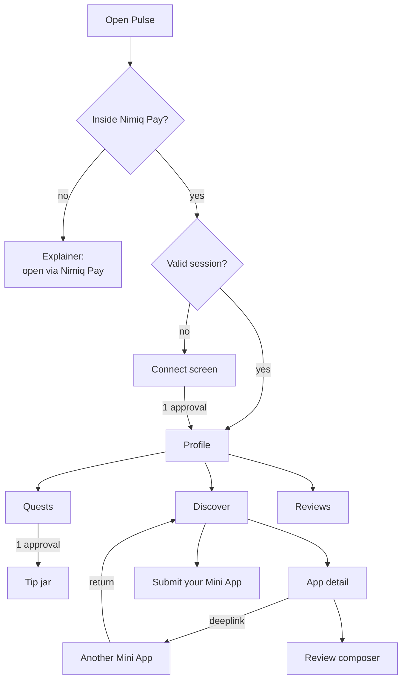
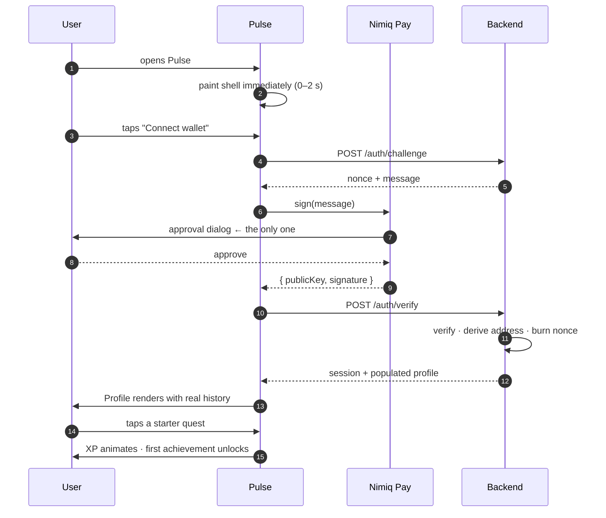
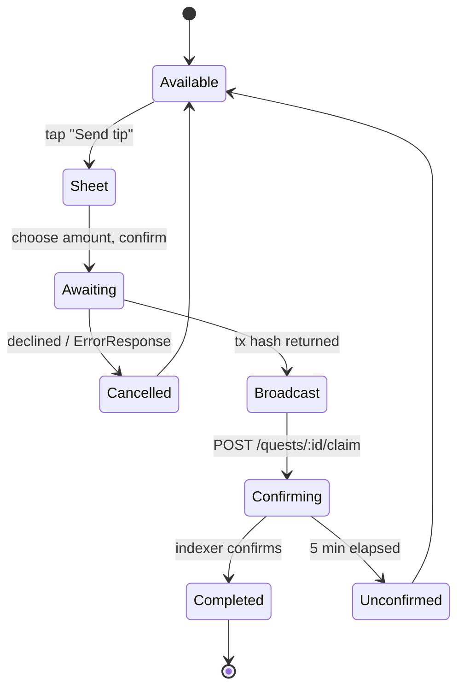
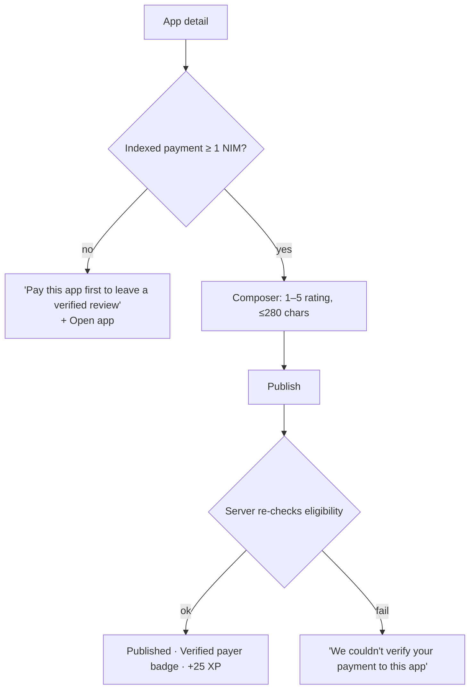

# Nimiq Pulse — User Flows

| Field | Value |
| --- | --- |
| Version | 1.0 · 31 July 2026 |
| Related | [INFORMATION_ARCHITECTURE.md](INFORMATION_ARCHITECTURE.md) · [ERROR_HANDLING.md](ERROR_HANDLING.md) · [PRD.md](PRD.md) |

Every flow below states its **success path**, its **failure paths**, and the **approval dialogs** it costs. Approval dialogs are the scarcest resource in the product; the count is a design budget, not a detail.

---

## 1. Flow map

---

## 2. Onboarding — zero to earning in under 60 seconds

**The flow the entire product is judged on.** Budget: **one** approval dialog.

| Step | Budget | What the user sees |
| --- | --- | --- |
| Paint | 0–2 s | Logo, one sentence of what Pulse is, one button. Never a spinner. |
| Disclosure | — | Above the button: *"Pulse reads your public payment history to find Mini Apps you'll like. It only stores payments to listed apps."* Before the approval, not after. |
| Approve | 5–15 s | One native dialog |
| Populate | 15–30 s | Profile with real achievements if the wallet has history |
| Zero-history | 30–45 s | "Starter Mini Apps to try" + a completable `STARTER` quest |
| Reward | 45–60 s | XP bar fills, first achievement arrives |

**Failure paths**

| Failure | Result |
| --- | --- |
| Not inside Nimiq Pay | Explainer screen with load instructions. Nothing crashes; non-wallet content stays readable. |
| `init()` times out (10 s) | Same explainer, plus "Try again" |
| User declines the dialog | Return to Connect. *"No problem — connect whenever you're ready."* No re-prompt, no nag. |
| Signature verification fails | *"That didn't verify. Try connecting again."* New nonce issued. |
| Backend unreachable | *"Can't reach Pulse right now."* Retry button. Cached session, if any, still opens the app read-only. |

**Why one dialog.** `listAccounts()` and `sign()` each raise a dialog. Since a Nimiq address derives from its public key, and `sign()` returns the public key, the address comes free with the proof. See [software_architecture.md](software_architecture.md) ADR-3.

---

## 3. Complete the tip-jar quest

The flow that guarantees real NIM usage. Budget: **one** approval.

1. Quests tab → `TIP_JAR` row → **Send tip**.
2. Bottom sheet: three preset amounts and a custom field. Shows the exact NIM amount and the XP reward. No hidden fee.
3. Confirm → **one** approval dialog.
4. Approved → sheet closes, row shows `Confirming…` with an indeterminate bar. The app stays fully usable; nothing blocks.
5. Indexer confirms → row flips to Completed, XP bar animates, any achievement arrives.

| Failure | Copy | Recovery |
| --- | --- | --- |
| Declined | "Payment cancelled — the quest is still open" | Row returns to Available |
| No consensus | "Nimiq Pay is still syncing. Try again in a moment." | Button disabled with the reason shown |
| Broadcast failed | "That payment didn't go through" | Retry |
| Not indexed in 5 min | "We couldn't confirm that payment yet. It may still land." | Row stays claimable; no XP awarded on an unverified claim |

The client's tx hash only **speeds up** lookup. The indexer would find the payment anyway, so a forged hash gains nothing.

---

## 4. Discover and open an app

Budget: **zero** approvals.

1. Discover paints from cache instantly, revalidates in the background.
2. Each card carries a reason chip — "Popular with wallets like yours", "Trending this week", "New this week". A recommendation without a stated reason reads as an ad.
3. Tap a card → app detail: description, distinct payers, rating (only at ≥3 reviews), reviews, Open.
4. **Open** fires `nimiqpay://miniapp?url=…` and leaves Pulse.
5. Returning restores from cache — no re-login, no re-approval.

| Condition | Behaviour |
| --- | --- |
| No matched history | Starter set, labelled "Starter Mini Apps to try" |
| Backend unreachable | Cached feed + "Couldn't refresh — showing your last synced data" |
| No cache and no network | Static starter set shipped with the bundle, labelled as such |
| Fewer than 5 registry entries | Starter set fills the remainder |

---

## 5. Write a verified review

Budget: **zero** approvals — eligibility comes from indexed history, not a fresh signature.

The gate is stated as a **route forward**, never as a locked door: the blocked state includes the button to open the app and pay. Eligibility is re-checked server-side on write; the client's view is only a hint.

One review per wallet per app. Editing creates a new version and updates the timestamp.

---

## 6. Submit a Mini App

The distribution mechanic. Budget: **zero** approvals. Target: **under 60 seconds**.

1. Discover → "Submit your Mini App" (persistent at the end of the feed).
2. One screen, six fields: name, receiving address, URL, one-line description (≤100 chars), category, contact (optional).
3. Address is validated for Nimiq format **as typed**, not on submit.
4. Submit → confirmation stating what happens next and when.

| Failure | Copy |
| --- | --- |
| Invalid address | "That doesn't look like a Nimiq address" — inline, live |
| Duplicate address | "This address is already registered to *App name*" |
| Missing field | Inline under the field; submit stays enabled so the user learns everything at once |
| Backend unreachable | "Couldn't submit right now" — entered values are preserved |

**Confirmation copy:** *"Submitted. We review new apps before they appear in Discover, usually within a few hours. You'll earn the Community Builder achievement once someone pays your app."*

That sentence does three jobs: sets expectations honestly (moderation exists), avoids the dead end, and shows the reward for participating. It also resolves the tension in ADR-6 — submission takes under a minute, visibility follows review, and the user is told so plainly rather than left guessing.

---

## 7. Returning user

Budget: **zero** approvals while the session is valid.

1. Open → cached Profile paints immediately.
2. Background revalidation updates XP, streak, and quests.
3. New achievements earned since last visit are presented once, on arrival.
4. Streak state is visible without a tap.

Session expiry (7 days) shows an inline "Reconnect" prompt with a button — **never** an approval dialog raised automatically. An unprompted dialog on app open is the fastest way to look untrustworthy.

---

## 8. Approval-dialog budget

| Flow | Dialogs | Justification |
| --- | --- | --- |
| First run to first reward | 1 | Login only |
| Tip-jar quest | 1 | The payment itself |
| Discover, open app, read reviews | 0 | Read-only |
| Write a review | 0 | Eligibility from indexed history |
| Submit a Mini App | 0 | Session already proves the wallet |
| Return visit | 0 | Session valid |

**A full first session — connect, browse, complete a quest, write a review, submit an app — costs two dialogs.** That is the number to defend in review. Any change that adds a third needs an explicit reason.
