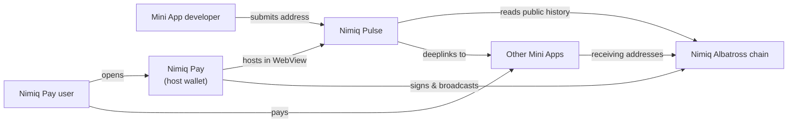
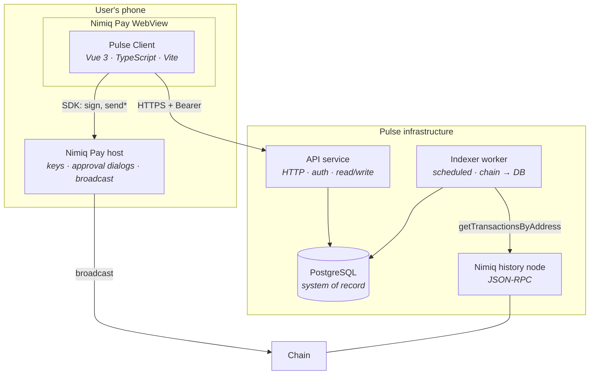
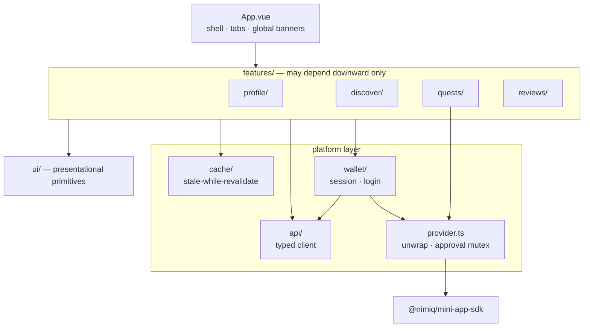
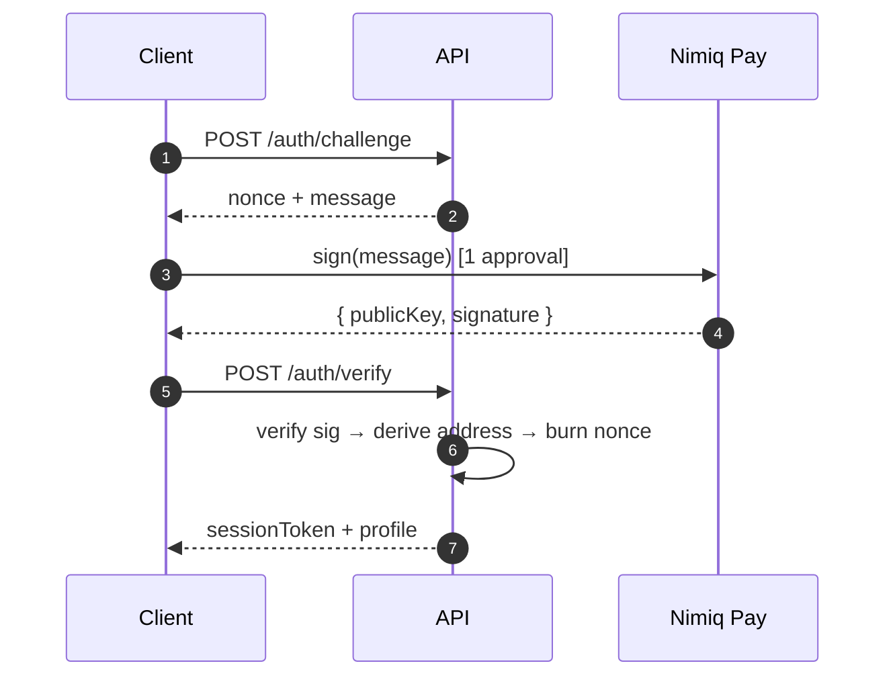
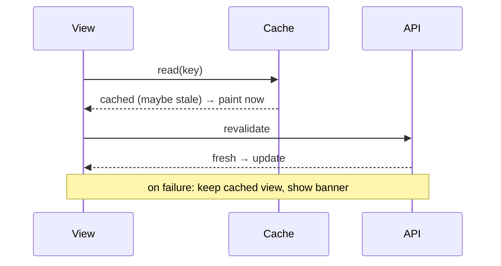
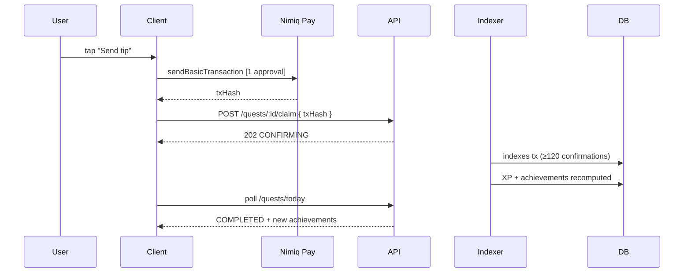
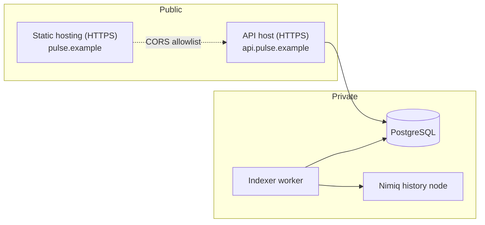

# Nimiq Pulse — Software Architecture

| Field | Value |
| --- | --- |
| Product | Nimiq Pulse |
| Version | 1.0 |
| Date | 31 July 2026 |
| Status | Draft for build |
| Audience | Engineers, reviewers, judges |
| Related | [PRD.md](PRD.md) · [TDD.md](TDD.md) |

---

## 1. Purpose

The PRD says what to build. The TDD says how each part works. This document says **how the parts are arranged, why they are arranged that way, and what must never change without a deliberate decision.**

---

## 2. Architectural drivers

Ranked. When two conflict, the higher one wins.

| # | Driver | Consequence |
| --- | --- | --- |
| A1 | **Trust cannot live in the client** | The Mini App runs on a user's device in a WebView they control. Every reward, eligibility check, and rank is computed server-side. |
| A2 | **The provider cannot read chain history** | An independent chain-indexing component is mandatory, not optional. This is the constraint that creates the backend. |
| A3 | **Mobile-first, weak network** | Cached-first client; the network is treated as an enhancement, never a prerequisite for rendering. |
| A4 | **Approval dialogs are scarce and interruptive** | Wallet interaction is funnelled through a single guarded path with an enforced mutex. |
| A5 | **Demo-day reliability** | No dependency on an unverified third-party endpoint; graceful degradation everywhere. |
| A6 | **Real data only** | No mock layer exists in any build configuration, so shipping fake data is impossible by construction. |

---

## 3. Constraints

| Constraint | Source | Architectural impact |
| --- | --- | --- |
| Runs in a mobile WebView inside Nimiq Pay | Platform | No desktop layouts; 375 px minimum; 44 px tap targets |
| No key access; all signing via native dialog | Platform | Client cannot authenticate itself cryptographically without user consent — shapes the session design |
| Provider resolves errors instead of rejecting | SDK (`ErrorResponse`) | A single mandatory adapter must normalise this before any feature code sees it |
| No transaction history in the provider | SDK | Backend + history node required |
| Device identifier is **origin-scoped** | SDK | Production origin must be fixed before launch; it is effectively part of the data model |
| LAN dev is plain HTTP | Platform | Secure-context APIs need fallbacks |
| No confirmed public RPC endpoint | Investigation (TDD §2.5) | Self-hosted node; endpoint is configuration |

---

## 4. System context

Pulse depends on the chain and on Nimiq Pay. It depends on **no other team's cooperation** — it reads public data and links out via public deeplinks. That independence is a deliberate architectural property, not an accident: it is what makes the registry viable without partnerships.

---

## 5. Container view

| Container | Responsibility | Explicitly **not** responsible for |
| --- | --- | --- |
| Client | Rendering, caching, orchestrating wallet interaction | Deciding XP, eligibility, or rank |
| API | Authorisation, reads, writes, verification | Talking to the chain directly |
| Indexer | Chain → database projection | Serving user requests |
| PostgreSQL | System of record and idempotency guarantees | Caching (that is the client's job) |
| History node | Chain access | Any Pulse business logic |

**The API never calls the chain and the indexer never serves users.** That split keeps request latency independent of chain latency — the single most important property for the performance budget.

---

## 6. Client component view

### 6.1 Dependency rules

These are the invariants. Violating one is a design defect, not a style preference.

1. **`features/` never imports `features/`.** Cross-feature communication goes through `wallet/` state or the API. This keeps the four tabs independently reviewable and independently deletable.
2. **Only `provider.ts` imports `@nimiq/mini-app-sdk`.** No feature calls the SDK directly. This is what guarantees the `ErrorResponse` normalisation and the approval mutex cannot be bypassed.
3. **`ui/` imports nothing from `features/`, `api/`, or `wallet/`.** Primitives stay presentational and testable without mounting the app.
4. **All network access goes through `api/client.ts`.** No bare `fetch` in feature code, so auth, timeout, retry, and error mapping are applied uniformly.
5. **Nothing writes to the cache except `cache/store.ts`.** One eviction and TTL policy, one place to reason about staleness.

### 6.2 The provider adapter is load-bearing

`provider.ts` is small but structurally critical. It enforces three things at once:

- **Error normalisation** — turns the SDK's resolved `ErrorResponse` into a thrown error, so a declined approval cannot be mistaken for success anywhere in the codebase.
- **Approval serialisation** — a mutex prevents two native dialogs being requested concurrently, satisfying the platform's sequencing rule by construction rather than by developer discipline.
- **Single point of substitution** — the only place that knows the SDK exists, so an SDK upgrade touches one file.

Rule 2 exists to protect these three properties. If a feature imports the SDK directly, all three are silently lost.

---

## 7. Key data flows

### 7.1 Login — one dialog

Deriving the address from the signing public key removes the `listAccounts()` call entirely, halving the approval dialogs on first run. See TDD §4.3.

### 7.2 Read path — cached first

The view **never** waits on the network to paint. Failure degrades to staleness, never to a blank screen.

### 7.3 Write path — earning XP

The client's `txHash` is a **hint that accelerates lookup, not evidence**. The indexer would find the transaction regardless. This is what makes the system trustworthy: a forged claim changes nothing.

---

## 8. Technology choices

| Layer | Choice | Why | Rejected |
| --- | --- | --- | --- |
| Client framework | Vue 3 + TS | Reference Mini Apps use Vue; the skill recommends it; already scaffolded | React (no advantage here), Svelte (smaller ecosystem for this platform) |
| Build | Vite | Mini App standard; `host: true` required for LAN device testing | Webpack (slower, no benefit) |
| Wallet access | `@nimiq/mini-app-sdk` | The only supported path to the Nimiq provider | Direct `window.nimiq` — explicitly forbidden by the skill |
| Chain verification | `@nimiq/core` (Node) | Provides `PublicKey.verify` and `toAddress()` for server-side login verification | Hand-rolled Ed25519 + Blake2b (needless risk) |
| Datastore | PostgreSQL | Uniqueness constraints are how idempotency is enforced; relational joins suit co-occurrence | Firebase/Mongo — weaker multi-column uniqueness guarantees |
| Client cache | `localStorage` + SWR wrapper | Small payloads, synchronous read, instant paint | IndexedDB (async, more code, unnecessary at this size) |
| Session | Short-lived JWT | Stateless verification; re-login costs only one dialog | Server sessions (needs sticky state), refresh tokens (extra theft surface) |
| EVM libraries | **None** | Nimiq provider only; no ERC-20 in scope | `viem` — would be dead weight |

---

## 9. Deployment

| Concern | Decision |
| --- | --- |
| Client hosting | Static HTTPS. Production origin **fixed before launch** — device IDs are origin-scoped, so changing it resets abuse limits |
| CORS | Explicit allowlist of the Mini App origin. Never `*` in production. Dev adds the LAN origin |
| Config | `NIMIQ_NETWORK`, `NIMIQ_RPC_URL`, `NIMIQ_RPC_AUTH`, `DATABASE_URL`, `JWT_SECRET`, `TIP_JAR_ADDRESS`, `MIN_REVIEW_LUNA`, `CONFIRMATIONS` |
| Secrets | Backend only. The client bundle contains zero credentials |
| Node placement | Private network; never reachable from the client |
| Distribution | `nimiqpay://miniapp?url=https://pulse.example` |

---

## 10. Failure modes

| Failure | Blast radius | Degradation |
| --- | --- | --- |
| API down | Reads and writes | Cached content renders; a banner explains; writes queue and are retried |
| Indexer down | XP and quest confirmation stall | Existing state serves; `Confirming…` persists; `/health` exposes cursor lag |
| History node down | Indexer only | Indexer backs off and resumes; user-facing reads unaffected — this is the payoff of separating API from indexer |
| Database down | Everything server-side | Client remains usable from cache; a full outage is visible, not silent |
| Nimiq Pay unavailable | Wallet actions | App explains it must be opened in Nimiq Pay; read-only content still renders |
| Registry empty | Feed quality | Starter set carries the feed; submission CTA is promoted |

No single failure produces a blank screen. That property is inherited from the cached-first client (A3) rather than handled case by case.

---

## 11. Architecture decision records

### ADR-1 — Introduce a backend rather than a client-only Mini App

**Status:** Accepted. **Context:** The provider exposes no transaction history, and Pulse's entire mechanic is history-versus-registry matching. Additionally, XP, quests, reviews, and the registry are shared state across wallets. **Decision:** Build an API, an indexer, and a database. **Consequences:** More infrastructure and a real demo-day dependency; in exchange, trust is enforceable, the client stays thin and fast, and cross-wallet features (co-occurrence, trending, reviews) become possible at all. **Alternatives rejected:** client-only with local storage — cannot compute co-occurrence, cannot prevent forged XP, cannot host a shared registry.

### ADR-2 — Embed the `@nimiq/core` light client in the backend

**Status:** Accepted — **supersedes the original "self-host a history node" decision.**

**Context.** No external chain data source was confirmed working: `rpc.nimiq.com` does not resolve, `rpc.nimiq-testnet.com` returned HTTP 405 on POST across several paths, and `api.nimiq.watch` serves an explorer UI rather than a documented API. The original decision was therefore to run a full Nimiq history node, which put a long infrastructure task on the critical path.

**What changed.** Measured on 31 July 2026: an embedded `@nimiq/core` light client running inside the backend process reaches mainnet consensus in ~36–40 s, automatically peers with history nodes (23 of 24 peers in testing), and answers `getTransactionsByAddress` with full transaction detail — sender, recipient, value in Luna, block height — in 11–16 s per address. No external endpoint is involved at all.

**Decision.** The backend embeds the light client (`src/chain.ts`). No history node, no public RPC.

**Consequences.** The critical-path infrastructure item disappears entirely. Address queries are slow (11–16 s), so nothing user-facing ever awaits one: the indexer sweeps one registry address per tick in the background and the API only ever reads SQLite. Consensus takes ~40 s at boot, so the API starts serving from the database immediately and the indexer starts once consensus lands.

**Revisit when:** the registry grows past roughly 100 apps, at which point a full sweep cycle exceeds ~25 minutes and either the sweep needs parallelising or a real history node becomes worthwhile.

### ADR-3 — Derive the wallet address from the login signature

**Status:** Accepted. **Context:** `listAccounts()` and `sign()` each raise an approval dialog. Doing both back-to-back on first run violates the platform's approval-sequencing rule and doubles onboarding friction against a 60-second budget. **Decision:** Call only `sign()` on a server-issued nonce, and derive the address server-side from the returned public key via `@nimiq/core`. **Consequences:** One dialog instead of two; the server gets a cryptographically proven address rather than a self-reported one. `listAccounts()` is not used in the login path.

### ADR-4 — Centralise all provider access behind one adapter

**Status:** Accepted. **Context:** The SDK *resolves* with `ErrorResponse` on failure and on user denial rather than rejecting, so ordinary `try/catch` misreads a denial as success. The platform also forbids concurrent approval dialogs. **Decision:** All SDK access goes through `provider.ts`, which normalises errors and serialises approvals. Feature code importing the SDK directly is a review-blocking defect. **Consequences:** One file to test heavily and one file to change on SDK upgrade; two whole classes of bug become structurally impossible.

### ADR-5 — Enforce idempotency with database constraints, not application logic

**Status:** Accepted. **Context:** Chain data is reprocessed on reindex; users double-tap; the head-changed listener was observed firing twice per macro block. **Decision:** `interactions.tx_hash` primary key, `xp_events UNIQUE(wallet, kind, source_ref)`, `quest_completions` composite PK, `reviews UNIQUE(wallet, app)`. **Consequences:** Retries and reindexing are safe by construction; duplicate-award bugs cannot be introduced by a careless code path.

### ADR-6 — Moderate registry submissions before feed visibility

**Status:** Accepted. **Context:** The feed's value is trust; an open write endpoint invites spam and malicious addresses. **Decision:** Submissions enter `PENDING` and appear only after approval. **Consequences:** A human is on the critical path for developer onboarding, in tension with the "listed in under a minute" promise. The submission *takes* under a minute; visibility follows review, and the submitter is told so explicitly. **Alternative rejected:** auto-approve — one malicious entry would discredit the whole feed.

### ADR-7 — Cached-first client with no loading gates

**Status:** Accepted. **Context:** Mobile WebView, weak networks, and a demo that must not stall. **Decision:** Every view paints from cache or skeleton immediately; the network only ever upgrades what is on screen. **Consequences:** Users may briefly see stale data, which is disclosed via a syncing pill and a stale banner. In exchange, there is no blank-screen failure mode anywhere.

### ADR-8 — No mock data in any build

**Status:** Accepted. **Context:** "Real on-chain data" is the product's central claim and a scoring criterion. A mock layer tends to leak into demos. **Decision:** No fixtures outside the test suite; empty states are designed as real product surfaces (starter set) rather than placeholders. **Consequences:** Development requires a working indexer earlier than a mocked approach would; the claim stays honest under scrutiny.

---

## 12. Quality attributes

| Attribute | Tactic | Verified by |
| --- | --- | --- |
| Performance | Cached-first; precomputed feed; API/indexer split | TDD §11 budgets |
| Reliability | Constraint-based idempotency; confirmation depth 120; degradation everywhere | TDD §13.2 |
| Security | Server-side verification; nonce replay protection; no client secrets | TDD §10 |
| Usability | 44 px targets; 375 px minimum; one approval per intent; populated empty states | Skill checklist §2, §5 |
| Testability | Layered dependency rules; pure XP engine over persisted rows | TDD §13.1 |
| Evolvability | Provider isolated to one file; RPC endpoint is config; features independent | ADR-2, ADR-4 |

---

## 13. Evolution

| Phase | Change | Enabled by |
| --- | --- | --- |
| 2 | Sponsored placement | Ranking is one scoring function in one module — add a term, not a rewrite |
| 2 | Developer analytics | `interactions` already holds everything needed; add read-only endpoints |
| 3 | Public API / SDK | The API is already the only write path; publishing it is a documentation and rate-limiting exercise |
| 3 | Cross-chain | Requires the Ethereum provider and `viem`; isolated to `provider.ts` and a new indexer, leaving features untouched |
| — | Public RPC becomes available | Change `NIMIQ_RPC_URL`; no code change (ADR-2) |

The architecture's main bet is that **the four features are independent and the platform layer is thin and centralised.** As long as dependency rules 1–5 hold, any single feature can be replaced without touching the others, and the SDK can change under one file.
